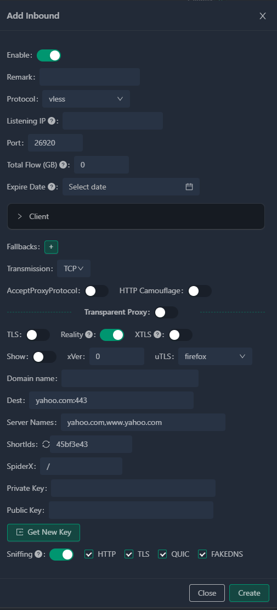
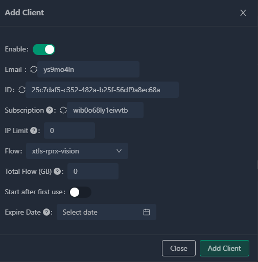
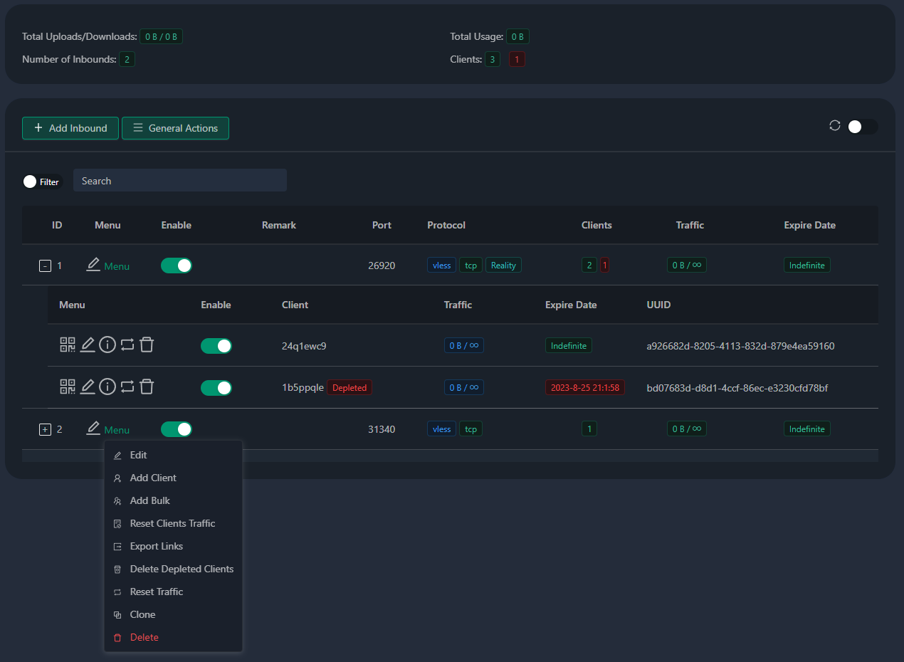
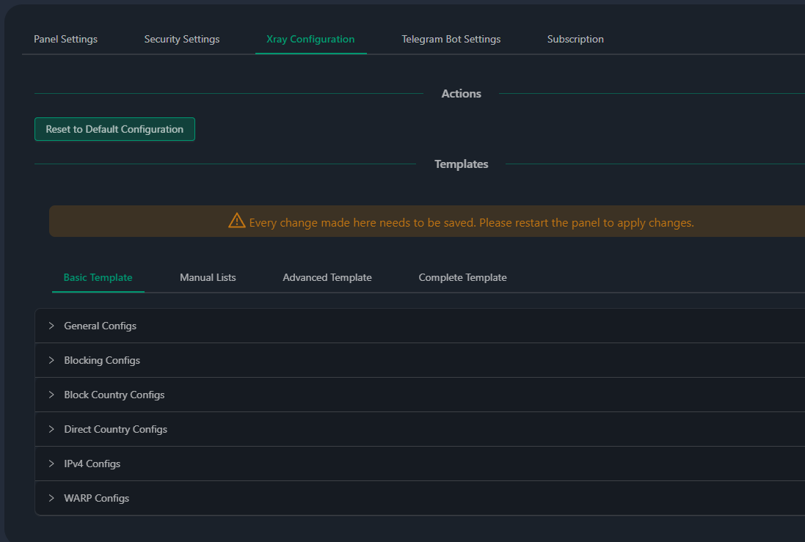
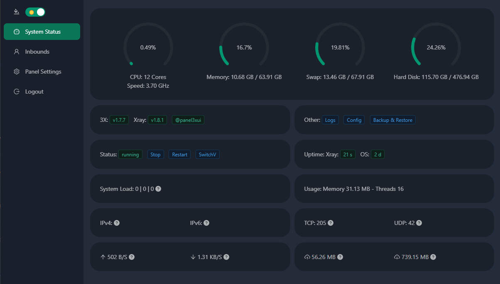
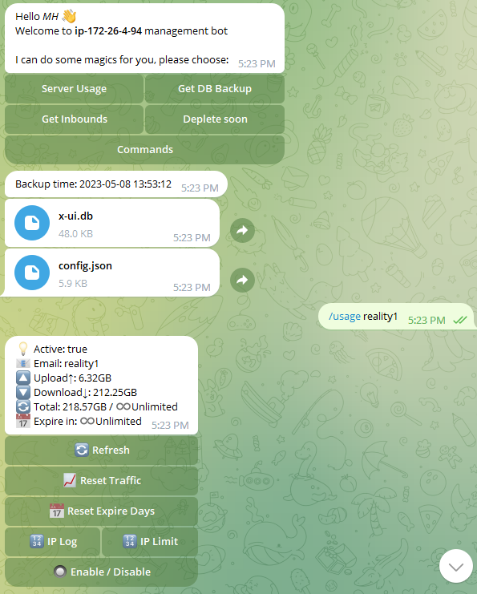

# 3x-ui

# Cài đặt & nâng cấp

```
bash <(curl -Ls https://raw.githubusercontent.com/Thaomtam/3X-UI/main/install.sh)
```

# SSL

```
apt-get install certbot -y
certbot certonly --standalone --agree-tos --register-unsafely-without-email -d yourdomain.com
certbot renew --dry-run
```

Bạn cũng có thể sử dụng menu `x-ui` sau đó chọn `Quản lý chứng chỉ SSL`

# Đặc trưng

- Giám sát trạng thái hệ thống
- Tìm kiếm trong tất cả các khách hàng và khách hàng
- Hỗ trợ giao diện người dùng chủ đề Tối/Sáng
- Hỗ trợ nhiều người dùng, đa giao thức, thao tác trực quan hóa trang web
- Các giao thức được hỗ trợ: vmess, vless, trojan, Shadowocks, dokodemo-door, vớ, http
- Hỗ trợ cấu hình nhiều cấu hình vận chuyển hơn
- Thống kê lưu lượng, giới hạn lưu lượng, giới hạn thời gian hết hạn
- Mẫu cấu hình xray có thể tùy chỉnh
- Hỗ trợ truy cập https (tên miền tự cung cấp + chứng chỉ ssl)
- Hỗ trợ ứng dụng chứng chỉ SSL bằng một cú nhấp chuột và tự động gia hạn
- Để biết thêm các mục cấu hình nâng cao, vui lòng tham khảo bảng
- Sửa các tuyến đường api (cài đặt người dùng sẽ tạo bằng api)
- Hỗ trợ thay đổi cấu hình theo các mục khác nhau được cung cấp trong bảng điều khiển
- Hỗ trợ xuất/nhập cơ sở dữ liệu từ bảng điều khiển
- 
# Thiết lập mặc định

<details>
  <summary>Nhấp để xem chi tiết cài đặt mặc định</summary>

- Port: 2053
- tên người dùng và mật khẩu sẽ được tạo ngẫu nhiên nếu bạn bỏ qua việc sửa đổi bảo mật của riêng mình (x-ui "7")
- database path: /etc/x-ui/x-ui.db
- xray config path: /usr/local/x-ui/bin/config.json

Trước khi bạn đặt ssl trên cài đặt

- http://ip:2053/panel
- http://domain:2053/panel

Sau khi bạn đặt ssl trên cài đặt

- https://yourdomain:2053/panel
</details>

# Suggestion System

- Ubuntu 20.04+
- Debian 10+
- CentOS 8+
- Fedora 36+
- Arch Linux

# Pictures








## Stargazers over time

[](https://starchart.cc/MHSanaei/3x-ui)
