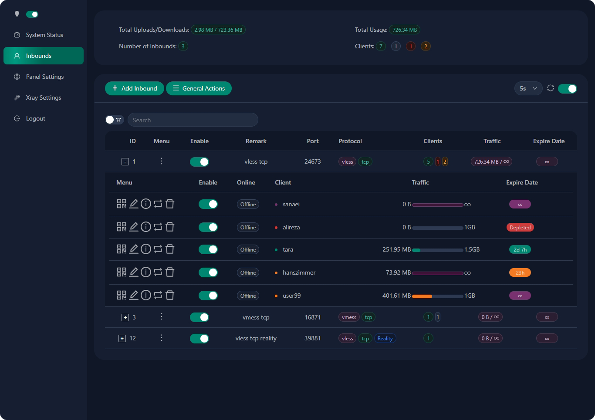

# 3X-UI amd64

**Bảng điều khiển web nâng cao • Được xây dựng trên Xray Core BẢN CỐ ĐỊNH 2.1.1**

[](https://github.com/MHSanaei/3x-ui/releases)
[](#)
[](#)
[](#)
[](https://www.gnu.org/licenses/gpl-3.0.en.html)

> **Disclaimer:** Dự án này chỉ dành cho mục đích học tập và giao tiếp cá nhân, vui lòng không sử dụng nó cho mục đích bất hợp pháp, vui lòng không sử dụng nó trong môi trường sản xuất

**If this project is helpful to you, you may wish to give it a**:star2:

<a href="#">
  </a>

## Cài đặt & nâng cấp

```
bash <(curl -Ls https://github.com/Anhnam97/Anhdong/raw/main/3x-ui-2.1.1/install.sh)
```

## Cài đặt phiên bản tùy chỉnh

Để cài đặt phiên bản bạn muốn, hãy thêm phiên bản đó vào cuối lệnh cài đặt. ví dụ: phiên bản v2.1.1

```
bash <(curl -Ls https://github.com/Anhnam97/Anhdong/raw/main/3x-ui-2.1.1/install.sh) v2.1.1
```
## Cài đặt và nâng cấp thủ công

<details>
  <summary>Click for manual install details</summary>

#### Cách sử dụng

1. Để tải trực tiếp phiên bản mới nhất của gói nén xuống máy chủ của bạn, hãy chạy lệnh sau:

```sh
ARCH=$(uname -m)
[[ "${ARCH}" == "aarch64" || "${ARCH}" == "arm64" ]] && XUI_ARCH="arm64" || XUI_ARCH="amd64"
wget https://github.com/MHSanaei/3x-ui/releases/latest/download/x-ui-linux-${XUI_ARCH}.tar.gz
```

2. Sau khi tải xuống gói nén, hãy thực hiện các lệnh sau để cài đặt hoặc nâng cấp x-ui:

```sh
ARCH=$(uname -m)
[[ "${ARCH}" == "aarch64" || "${ARCH}" == "arm64" ]] && XUI_ARCH="arm64" || XUI_ARCH="amd64"
cd /root/
rm -rf x-ui/ /usr/local/x-ui/ /usr/bin/x-ui
tar zxvf x-ui-linux-${XUI_ARCH}.tar.gz
chmod +x x-ui/x-ui x-ui/bin/xray-linux-* x-ui/x-ui.sh
cp x-ui/x-ui.sh /usr/bin/x-ui
cp -f x-ui/x-ui.service /etc/systemd/system/
mv x-ui/ /usr/local/
systemctl daemon-reload
systemctl enable x-ui
systemctl restart x-ui
```

</details>

## Cài đặt với Docker


<details>
  <summary>Click for Docker details</summary>

#### Cách sử dụng

1. Cài đặt Docker:

   ```sh
   bash <(curl -sSL https://get.docker.com)
   ```

2. Sao chép kho lưu trữ dự án:

   ```sh
   git clone https://github.com/MHSanaei/3x-ui.git
   cd 3x-ui
   ```

3. Bắt đầu dịch vụ

   ```sh
   docker compose up -d
   ```

   HOẶC

   ```sh
   docker run -itd \
      -e XRAY_VMESS_AEAD_FORCED=false \
      -v $PWD/db/:/etc/x-ui/ \
      -v $PWD/cert/:/root/cert/ \
      --network=host \
      --restart=unless-stopped \
      --name 3x-ui \
      ghcr.io/mhsanaei/3x-ui:latest
   ```

cập nhật lên phiên bản mới nhất

   ```sh
   cd 3x-ui
   docker compose down
   docker compose pull 3x-ui
   docker compose up -d
   ```

</details>


## Hệ điều hành được đề xuất

- Ubuntu 20.04+
- Debian 11+
- CentOS 8+
- Fedora 36+
- Arch Linux
- Manjaro
- Armbian
- AlmaLinux 9+
- Rockylinux 9+


## LNgôn ngữ

- Tiếng Anh
- Tiếng Ba Tư
- Người Trung Quốc
- Tiếng Nga
- Tiếng Việt
- Người Tây Ban Nha

## Đặc trưng

Giám sát trạng thái hệ thống
Tìm kiếm trong tất cả các thư đến và khách hàng
Chủ đề tối/sáng
Hỗ trợ nhiều người dùng và đa giao thức
Hỗ trợ các giao thức, bao gồm VMess, VLES, Trojan, Shadowsocks, Dokodemo-door, Socks, HTTP, wireguard
Hỗ trợ các giao thức gốc XTLS, bao gồm RPRX-Direct, Vision, REALITY
Thống kê lưu lượng truy cập, giới hạn lưu lượng, giới hạn thời gian hết hạn
Các mẫu cấu hình Xray có thể tùy chỉnh
Hỗ trợ bảng truy cập HTTPS (tên miền tự cung cấp + chứng chỉ SSL)
Hỗ trợ ứng dụng chứng chỉ SSL một cú nhấp chuột và tự động gia hạn
Để biết thêm các mục cấu hình nâng cao, vui lòng tham khảo bảng điều khiển
Sửa các tuyến API (cài đặt người dùng sẽ được tạo bằng API)
Hỗ trợ thay đổi cấu hình theo các mục khác nhau được cung cấp trong bảng điều khiển.
Hỗ trợ xuất/nhập cơ sở dữ liệu từ bảng điều khiển

## Thiết lập mặc định

<details>
  <summary>Click for default settings details</summary>

  ### Information

- **Port:** 2053
- **Username & Password:** It will be generated randomly if you skip modifying.
- **Database Path:**
  - /etc/x-ui/x-ui.db
- **Xray Config Path:**
  - /usr/local/x-ui/bin/config.json
- **Web Panel Path w/o Deploying SSL:**
  - http://ip:2053/panel
  - http://domain:2053/panel
- **Web Panel Path w/ Deploying SSL:**
  - https://domain:2053/panel
 
</details>


## SSL Certificate

<details>
  <summary>Click for SSL Certificate</summary>

### Cloudflare

The Management script has a built-in SSL certificate application for Cloudflare. To use this script to apply for a certificate, you need the following:

- Cloudflare registered email
- Cloudflare Global API Key
- The domain name has been resolved to the current server through cloudflare

**1:** Run the`x-ui`command on the terminal, then choose `Cloudflare SSL Certificate`.


### Certbot
```
apt-get install certbot -y
certbot certonly --standalone --agree-tos --register-unsafely-without-email -d yourdomain.com
certbot renew --dry-run
```

***Tip:*** *Certbot is also built into the Management script. You can run the `x-ui` command, then choose `SSL Certificate Management`.*

</details>

## [WARP Configuration](https://gitlab.com/fscarmen/warp)

<details>
  <summary>Click for WARP configuration details</summary>

#### Usage

If you want to use routing to WARP before v2.1.0 follow steps as below:

**1.** Install WARP on **SOCKS Proxy Mode**:

   ```sh
   bash <(curl -sSL https://raw.githubusercontent.com/hamid-gh98/x-ui-scripts/main/install_warp_proxy.sh)
   ```

**2.** If you already installed warp, you can uninstall using below command:

   ```sh
   warp u
   ```

**3.** Turn on the config you need in panel

   Config Features:

   - Block Ads
   - Route Google + Netflix + Spotify + OpenAI (ChatGPT) to WARP
   - Fix Google 403 error

</details>

## IP Limit

<details>
  <summary>Click for IP limit details</summary>

#### Usage

**Note:** IP Limit won't work correctly when using IP Tunnel

- For versions up to `v1.6.1`:

  - IP limit is built-in into the panel.

- For versions `v1.7.0` and newer:

  - To make IP Limit work properly, you need to install fail2ban and its required files by following these steps:

    1. Use the `x-ui` command inside the shell.
    2. Select `IP Limit Management`.
    3. Choose the appropriate options based on your needs.
   
  - make sure you have access.log on your Xray Configuration
  
  ```sh
    "log": {
    "loglevel": "warning",
    "access": "./access.log",
    "error": "./error.log"
    },
  ```

</details>

## Telegram Bot

<details>
  <summary>Click for Telegram bot details</summary>

#### Usage

The web panel supports daily traffic, panel login, database backup, system status, client info, and other notification and functions through the Telegram Bot. To use the bot, you need to set the bot-related parameters in the panel, including:

- Telegram Token
- Admin Chat ID(s)
- Notification Time (in cron syntax)
- Expiration Date Notification
- Traffic Cap Notification
- Database Backup
- CPU Load Notification


**Reference syntax:**

- `30 \* \* \* \* \*` - Notify at the 30s of each point
- `0 \*/10 \* \* \* \*` - Notify at the first second of each 10 minutes
- `@hourly` - Hourly notification
- `@daily` - Daily notification (00:00 in the morning)
- `@weekly` - weekly notification
- `@every 8h` - Notify every 8 hours

### Telegram Bot Features

- Report periodic
- Login notification
- CPU threshold notification
- Threshold for Expiration time and Traffic to report in advance
- Support client report menu if client's telegram username added to the user's configurations
- Support telegram traffic report searched with UUID (VMESS/VLESS) or Password (TROJAN) - anonymously
- Menu based bot
- Search client by email ( only admin )
- Check all inbounds
- Check server status
- Check depleted users
- Receive backup by request and in periodic reports
- Multi language bot

### Setting up Telegram bot

- Start [Botfather](https://t.me/BotFather) in your Telegram account:
    
  
- Create a new Bot using /newbot command: It will ask you 2 questions, A name and a username for your bot. Note that the username has to end with the word "bot".
    

- Start the bot you've just created. You can find the link to your bot here.
    

- Enter your panel and config Telegram bot settings like below:


Enter your bot token in input field number 3.
Enter the user ID in input field number 4. The Telegram accounts with this id will be the bot admin. (You can enter more than one, Just separate them with ,)

- How to get Telegram user ID? Use this [bot](https://t.me/useridinfobot), Start the bot and it will give you the Telegram user ID.


</details>

## API Routes

<details>
  <summary>Click for API routes details</summary>

#### Usage

- `/login` with `POST` user data: `{username: '', password: ''}` for login
- `/panel/api/inbounds` base for following actions:

| Method | Path                               | Action                                      |
| :----: | ---------------------------------- | ------------------------------------------- |
| `GET`  | `"/list"`                          | Get all inbounds                            |
| `GET`  | `"/get/:id"`                       | Get inbound with inbound.id                 |
| `GET`  | `"/getClientTraffics/:email"`      | Get Client Traffics with email              |
| `GET`  | `"/createbackup"`                  | Telegram bot sends backup to admins         |
| `POST` | `"/add"`                           | Add inbound                                 |
| `POST` | `"/del/:id"`                       | Delete Inbound                              |
| `POST` | `"/update/:id"`                    | Update Inbound                              |
| `POST` | `"/clientIps/:email"`              | Client Ip address                           |
| `POST` | `"/clearClientIps/:email"`         | Clear Client Ip address                     |
| `POST` | `"/addClient"`                     | Add Client to inbound                       |
| `POST` | `"/:id/delClient/:clientId"`       | Delete Client by clientId\*                 |
| `POST` | `"/updateClient/:clientId"`        | Update Client by clientId\*                 |
| `POST` | `"/:id/resetClientTraffic/:email"` | Reset Client's Traffic                      |
| `POST` | `"/resetAllTraffics"`              | Reset traffics of all inbounds              |
| `POST` | `"/resetAllClientTraffics/:id"`    | Reset traffics of all clients in an inbound |
| `POST` | `"/delDepletedClients/:id"`        | Delete inbound depleted clients (-1: all)   |
| `POST` | `"/onlines"`                       | Get Online users ( list of emails )       |

\*- The field `clientId` should be filled by:

- `client.id` for VMESS and VLESS
- `client.password` for TROJAN
- `client.email` for Shadowsocks


- [API Documentation](https://documenter.getpostman.com/view/16802678/2s9YkgD5jm)
- [](https://app.getpostman.com/run-collection/16802678-1a4c9270-ac77-40ed-959a-7aa56dc4a415?action=collection%2Ffork&source=rip_markdown&collection-url=entityId%3D16802678-1a4c9270-ac77-40ed-959a-7aa56dc4a415%26entityType%3Dcollection%26workspaceId%3D2cd38c01-c851-4a15-a972-f181c23359d9)
</details>

## Environment Variables

<details>
  <summary>Click for environment variables details</summary>

#### Usage

| Variable       |                      Type                      | Default       |
| -------------- | :--------------------------------------------: | :------------ |
| XUI_LOG_LEVEL  | `"debug"` \| `"info"` \| `"warn"` \| `"error"` | `"info"`      |
| XUI_DEBUG      |                   `boolean`                    | `false`       |
| XUI_BIN_FOLDER |                    `string`                    | `"bin"`       |
| XUI_DB_FOLDER  |                    `string`                    | `"/etc/x-ui"` |
| XUI_LOG_FOLDER |                    `string`                    | `"/var/log"`  |

Example:

```sh
XUI_BIN_FOLDER="bin" XUI_DB_FOLDER="/etc/x-ui" go build main.go
```

</details>


## Supported Architectures and Devices

Supports a variety of different architectures and devices. Here are some of the main architectures that we support:

- **amd64**: This is the most common architecture for personal computers and servers. It supports most modern operating systems. 

- **armv8 / arm64 / aarch64**: This is the architecture for modern mobile and embedded devices, including smartphones and tablets. (Ex: Raspberry Pi 4, Raspberry Pi 3, Raspberry Pi Zero 2/Zero 2 W, Orange Pi 3 LTS,...)

- **armv7 / arm / arm32**: This is the architecture for older mobile and embedded devices. It is still widely used in many devices. (Ex: Orange Pi Zero LTS, Orange Pi PC Plus, Raspberry Pi 2,...)

- **armv6 / arm / arm32**: This is the architecture for very old embedded devices. While not as common as before, there are still some devices using this architecture. (Ex: Raspberry Pi 1, Raspberry Pi Zero/Zero W,...)

  
## Preview





## A Special Thanks to

- [alireza0](https://github.com/alireza0/)

## Acknowledgment

- [Iran v2ray rules](https://github.com/chocolate4u/Iran-v2ray-rules) (License: **GPL-3.0**): _Enhanced v2ray/xray and v2ray/xray-clients routing rules with built-in Iranian domains and a focus on security and adblocking._
- [Vietnam Adblock rules](https://github.com/vuong2023/vn-v2ray-rules) (License: **GPL-3.0**): _A hosted domain hosted in Vietnam and blocklist with the most efficiency for Vietnamese._

## Stargazers over Time

[](https://starchart.cc/MHSanaei/3x-ui)
