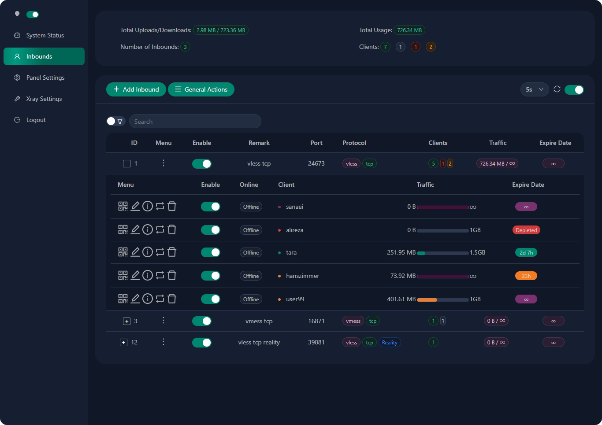
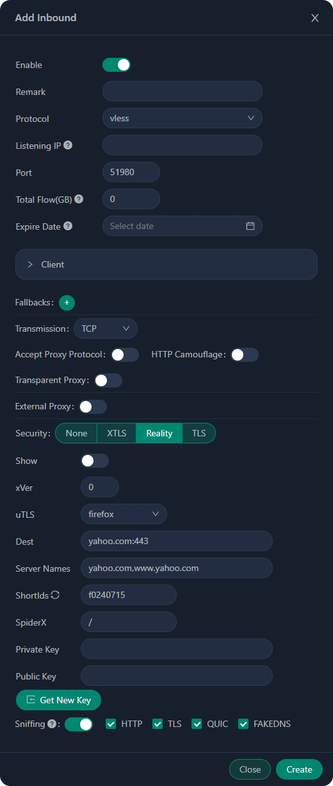
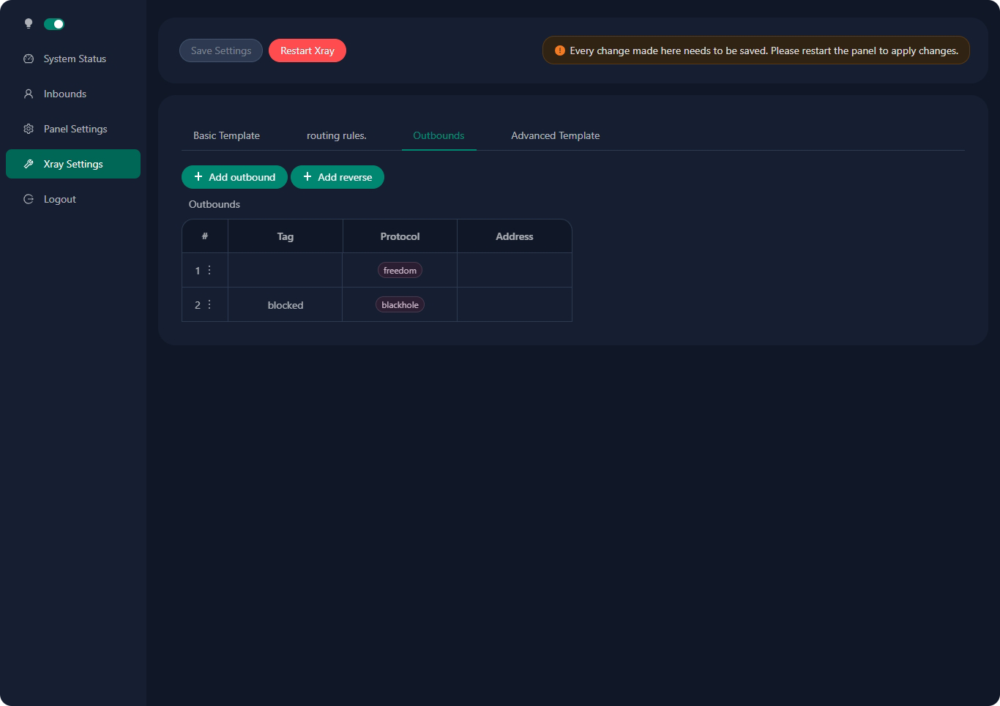

# 3X-UI amd64

**Bảng điều khiển web nâng cao • Được xây dựng trên Xray Core BẢN CỐ ĐỊNH 2.1.3**

[](https://github.com/MHSanaei/3x-ui/releases)
[](#)
[](#)
[](#)
[](https://www.gnu.org/licenses/gpl-3.0.en.html)

> **Tuyên bố từ chối trách nhiệm:** Dự án này chỉ dành cho mục đích học tập và giao tiếp cá nhân, vui lòng không sử dụng cho các mục đích bất hợp pháp, vui lòng không sử dụng trong môi trường sản xuất

**Nếu dự án này hữu ích cho bạn, hãy cân nhắc tặng nó một**:star2:

<a href="#">
  </a>

## Cài đặt & nâng cấp

```
bash <(curl -Ls https://github.com/Anhnam97/Anhdong/raw/main/3x-ui-2.1.3/install.sh)
```

## Cài đặt phiên bản tùy chỉnh

Để cài đặt phiên bản bạn mong muốn, thêm phiên bản vào cuối lệnh cài đặt. Ví dụ, phiên bản `v2.1.3`:

```
bash <(curl -Ls https://github.com/Anhnam97/Anhdong/raw/main/3x-ui-2.1.3/install.sh) v2.1.3
```
## PHIÊN BẢN 211
```
bash <(curl -Ls https://github.com/Anhnam97/Anhdong/raw/main/3x-ui-2.1.1/install.sh) v2.1.1
```

## Chứng chỉ SSL

<details>
  <summary>Nhấn để xem chi tiết chứng chỉ SSL</summary>

### Cloudflare

Script quản lý đã tích hợp sẵn ứng dụng chứng chỉ SSL cho Cloudflare. Để sử dụng script này để đăng ký chứng chỉ, bạn cần có các thông tin sau:

- Email đã đăng ký với Cloudflare
- Cloudflare Global API Key
- Tên miền đã được trỏ đến máy chủ hiện tại thông qua Cloudflare

**1:** Chạy lệnh `x-ui` trên terminal, sau đó chọn `Cloudflare SSL Certificate`.

### Certbot
```
apt-get install certbot -y
certbot certonly --standalone --agree-tos --register-unsafely-without-email -d yourdomain.com
certbot renew --dry-run
```

***Mẹo:*** *Certbot cũng được tích hợp sẵn trong script quản lý. Bạn có thể chạy lệnh `x-ui`, sau đó chọn `SSL Certificate Management`.*

</details>

## Cài đặt và nâng cấp thủ công

<details>
  <summary>Nhấn để xem chi tiết cài đặt thủ công</summary>

#### Sử dụng

1. Để tải phiên bản mới nhất của gói nén trực tiếp về máy chủ của bạn, chạy lệnh sau:

```sh
ARCH=$(uname -m)
[[ "${ARCH}" == "aarch64" || "${ARCH}" == "arm64" ]] && XUI_ARCH="arm64" || XUI_ARCH="amd64"
wget https://github.com/MHSanaei/3x-ui/releases/latest/download/x-ui-linux-${XUI_ARCH}.tar.gz
```

2. Sau khi tải xong gói nén, thực hiện các lệnh sau để cài đặt hoặc nâng cấp x-ui:

```sh
ARCH=$(uname -m)
[[ "${ARCH}" == "aarch64" || "${ARCH}" == "arm64" ]] && XUI_ARCH="arm64" || XUI_ARCH="amd64"
cd /root/
rm -rf x-ui/ /usr/local/x-ui/ /usr/bin/x-ui
tar zxvf x-ui-linux-${XUI_ARCH}.tar.gz
chmod +x x-ui/x-ui x-ui/bin/xray-linux-* x-ui/x-ui.sh
cp x-ui/x-ui.sh /usr/bin/x-ui
cp -f x-ui/x-ui.service /etc/systemd/system/
mv x-ui/ /usr/local/
systemctl daemon-reload
systemctl enable x-ui
systemctl restart x-ui
```

</details>

## Cài đặt với Docker

<details>
  <summary>Nhấn để xem chi tiết Docker</summary>

#### Sử dụng

1. Cài đặt Docker:

   ```sh
   bash <(curl -sSL https://get.docker.com)
   ```

2. Sao chép kho dự án:

   ```sh
   git clone https://github.com/MHSanaei/3x-ui.git
   cd 3x-ui
   ```

3. Khởi động dịch vụ

   ```sh
   docker compose up -d
   ```

   HOẶC

   ```sh
   docker run -itd \
      -e XRAY_VMESS_AEAD_FORCED=false \
      -v $PWD/db/:/etc/x-ui/ \
      -v $PWD/cert/:/root/cert/ \
      --network=host \
      --restart=unless-stopped \
      --name 3x-ui \
      ghcr.io/mhsanaei/3x-ui:latest
   ```

Cập nhật lên phiên bản mới nhất

   ```sh
    cd 3x-ui
    docker compose down
    docker compose pull 3x-ui
    docker compose up -d
   ```

Xóa 3x-ui khỏi Docker

   ```sh
    docker stop 3x-ui
    docker rm 3x-ui
    cd --
    rm -r 3x-ui
   ```

</details>


## Hệ điều hành được khuyến nghị

- Ubuntu 20.04+
- Debian 11+
- CentOS 8+
- Fedora 36+
- Arch Linux
- Manjaro
- Armbian
- AlmaLinux 9+
- Rockylinux 9+

## Kiến trúc và thiết bị tương thích

Hỗ trợ nhiều kiến trúc và thiết bị khác nhau. Dưới đây là một số kiến trúc chính mà chúng tôi hỗ trợ:

- **amd64**: Đây là kiến trúc phổ biến nhất cho máy tính cá nhân và máy chủ. Nó hỗ trợ hầu hết các hệ điều hành hiện đại.

- **x86 / i386**: Kiến trúc này phổ biến trong các máy tính để bàn và laptop. Nó được hỗ trợ rộng rãi bởi nhiều hệ điều hành và ứng dụng. (Ví dụ: Hầu hết các hệ điều hành Windows, macOS và Linux)

- **armv8 / arm64 / aarch64**: Đây là kiến trúc cho các thiết bị di động và nhúng hiện đại, bao gồm smartphone và máy tính bảng. (Ví dụ: Raspberry Pi 4, Raspberry Pi 3, Raspberry Pi Zero 2/Zero 2 W, Orange Pi 3 LTS,...)

- **armv7 / arm / arm32**: Đây là kiến trúc cho các thiết bị di động và nhúng cũ hơn. Nó vẫn còn được sử dụng rộng rãi trong nhiều thiết bị. (Ví dụ: Orange Pi Zero LTS, Orange Pi PC Plus, Raspberry Pi 2,...)

- **armv6 / arm / arm32**: Đây là kiến trúc cho các thiết bị nhúng rất cũ. Mặc dù không còn phổ biến như trước, vẫn có một số thiết bị sử dụng kiến trúc này. (Ví dụ: Raspberry Pi 1, Raspberry Pi Zero/Zero W,...)

- **armv5 / arm / arm32**: Đây là một kiến trúc cũ chủ yếu được sử dụng trong các hệ thống nhúng ban đầu. Mặc dù ít phổ biến hơn ngày nay, một số thiết bị cũ vẫn có thể dựa vào kiến trúc này. (Ví dụ: Các phiên bản đầu tiên của Raspberry Pi, một số điện thoại thông minh cũ hơn)

## Ngôn ngữ

- Tiếng Anh
- Tiếng Ba Tư
- Tiếng Trung
- Tiếng Nga
- Tiếng Việt
- Tiếng Tây Ban Nha
## Xem Trước









## Tính năng

- Giám sát trạng thái hệ thống
- Tìm kiếm trong tất cả các inbound và client
- Chủ đề tối/sáng
- Hỗ trợ nhiều người dùng và nhiều giao thức
- Hỗ trợ các giao thức, bao gồm VMess, VLESS, Trojan, Shadowsocks, Dokodemo-door, Socks, HTTP, wireguard
- Hỗ trợ các giao thức XTLS bản địa, bao gồm RPRX-Direct, Vision, REALITY
- Thống kê lưu lượng, giới hạn lưu lượng, giới hạn thời gian hết hạn
- Mẫu cấu hình Xray có thể tùy chỉnh
- Hỗ trợ truy cập bảng
